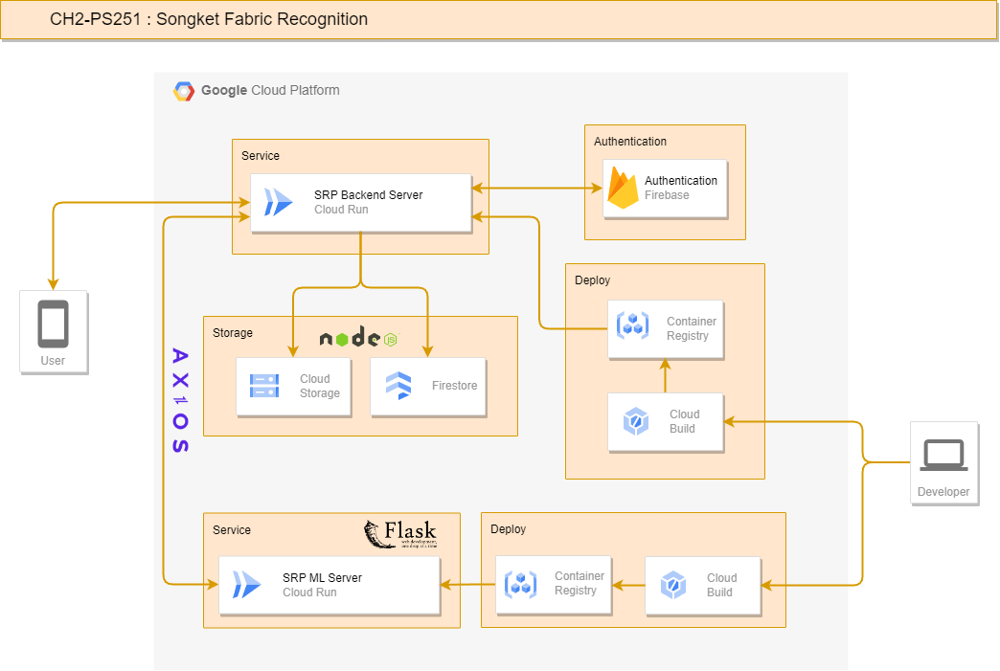

# Cloud Infrastructure


# API Reference
## Endpoint Routes

| Route                     | HTTP Method | Description                                 |
|---------------------------|-------------|---------------------------------------------|
| /register                 | POST        | Create User Account                         |
| /login                    | POST        | Login User Account                          |
| /users                    | GET         | Get All Users                               |
| /users/{{user_id}}        | GET         | Get Users By ID                             |
| /users/{{user_id}}        | PUT         | Edit Users By ID                            |
| /dataset                  | POST        | Create New Fabric Dataset                   |
| /dataset                  | GET         | Get All Fabric Datasets                     |
| /dataset/{{idfabric}}     | GET         | Get Fabric Datasets by ID                   |
| /dataset/{{idfabric}}     | PUT         | Update Fabric Datasets by ID                |
| /predict                  | POST        | Make Fabric Predictions from Images         |

## Endpoints USER
Many request to the Users API must include the `x-api-key` header with a valid API key. And here are example how to use it

### 1. Register User
Create User Account

#### `POST /register`

##### Request
- Method: POST
- Body:
  - `username` as String: Name of the user
  - `email` as String: Email of the user
  - `phone` as String: Phone number of the user
  - `password` as String: Password for the user

##### Response
- Status Code: 200 OK

##### Example Response
```json
{
    "error": false,
    "message": "Register Success"
}
```

### 2. Login User
Login User Account

#### `POST /login`

##### Request
- Method: POST
- Body:
  - `email` as String: Email of the user
  - `password` as String: Password for the user

##### Response
- Status Code: 200 OK
- Body: User object

##### Example Response
```json
{
    "error": false,
    "message": "Login Success",
    "loginResult": {
        "userId": "n36fYmDr1j8yZ6Z4QCrg",
        "name": "niawidiartinii",
        "email": "niaawd@gmail.com",
        "phone": "082114873847",
        "token": "TI4QBTOgy0QMbataLkGpIFd9OHn2"
    }
}
```

### 3. Get All Users
Retrieve information about all users.

#### `GET /users`

##### Request
- Method: GET
- Headers:
  - `x-api-key`: Your API Key

##### Response
- Status Code: 200 OK
- Body:
  - `users`: An array of user objects.

##### Example Response
```json
{
    "error": false,
    "message": "Users fetched successfully",
    "users": [
        {
            "password": "$2b$05$UkFzDsO5UEcR9qS75a5M7.QRUiwWSm8TC7bC9cQcniqUViBWYv6cm",
            "user_id": "0cjIA6jIC2xB3qrPGlAH",
            "phone": "08572854111",
            "firebase_uid": "xXkVwdHfB1fZCN2PkbGvtyHxgL72",
            "email": "yoshinori@gmail.com",
            "username": "yoshinori"
        },
        {
            "password": "$2b$05$GLTU3yvs.mGrPPGamLC8OulNOk4/OBcJz3MV89NqqnNK3Xk5H23fu",
            "user_id": "8cJX7tnUCyzcD0qSZ7Gg",
            "phone": "089679389728",
            "firebase_uid": "5w8CHClo0CUbIkbhbhZBZguX1d32",
            "email": "madedika83@gmail.com",
            "username": "dikadiki"
        },
        {
            "password": "$2b$05$1E1MIpZNBI593fkqMmVprO4WPoPBPyVwxwqdZeVzwaCI3mLmOSClK",
            "user_id": "jCn8XZkSVzHLwLEfqOWJ",
            "phone": "08572854111",
            "firebase_uid": "L0OERXP8HvWrBcvrFjYAbCNSLL62",
            "email": "doyoung@gmail.com",
            "username": "doyoung"
        },
        {
            "password": "$2b$05$SKhCue0NbeuW7YHEzE0Y8.PA1E18kwgcvWG2Y2S9bXNMa0M8Tl4Y2",
            "user_id": "n36fYmDr1j8yZ6Z4QCrg",
            "phone": "082114873847",
            "firebase_uid": "TI4QBTOgy0QMbataLkGpIFd9OHn2",
            "email": "niaawd@gmail.com",
            "username": "niawidiartinii"
        },
        {
            "password": "$2b$05$0aLHy20NpdTtHKlbSs5qW.teefU/1eWsIT96ygOE94QwwIimDlPoC",
            "user_id": "vtLKhtn7ajO4HquQuPGk",
            "phone": "08123456789",
            "firebase_uid": "K1bTqiTIVUa77MUDTfKNtBh8fh02",
            "email": "kwhy@gmail.com",
            "username": "Kwhy"
        }
    ]
}
```

### 4. Get User by ID
Retrieve information about a specific user identified by their ID.
#### `GET /users/{user_id}`

##### Request
- Method: GET
- Headers:
  - `x-api-key`: Your API Key
- Path Parameters:
  - `user_id`: The ID of the user

##### Response
- Status Code: 200 OK
- Body: User object
 
##### Example Response
```json
{
    "error": false,
    "message": "User fetched successfully",
    "users": {
        "password": "$2b$05$mNKlTWcg9lJXzx5gb1ym/uJeYsLkNZT.2I8CczulBCc7dwVlm/3Fu",
        "user_id": "tpBkSF3gkdJaHrTL7H7P",
        "phone": "0895723892398",
        "email": "madedika83@gmail.com",
        "username": "dikadiki",
        "token": "VkFAWLpY7iRMuY4O9M58trnZvRk1"
    }
}
```

### 5. Edit User by ID
Delete a specific user identified by their ID.

#### `PUT /users/{user_id}`

##### Request
- Method: POST
- Body:
  - `username` as String: Name of the user
  - `phone` as String: Phone number of the user
  - `password` as String: Password for the user

##### Response
- Status Code: 200 OK

##### Example Response
```json
{
    "error": false,
    "message": "User updated successfully",
    "users": {
        "user_id": "tpBkSF3gkdJaHrTL7H7P",
        "email": "madedika83@gmail.com",
        "token": "VkFAWLpY7iRMuY4O9M58trnZvRk1",
        "phone": "089679389728",
        "password": "$2b$05$BACPK4K4NXCMF4Q2vuLCEOZY3B7zivDTi9PKnDpXrV0xibLajSITe",
        "username": "I Made Mahardika Dharmajaya"
    }
}
```


## Endpoints DATASET
All requests to the Dataset API must include the `x-api-key` header with a valid API key. And here are example how to use it

### 1. Create Dataset
Create New Fabric Dataset

#### `POST /dataset`

##### Request
- Method: POST
- Headers:
  - `x-api-key`: Your API Key
- Body:
  - `fabricname` as String: Fabric Name of the Dataset
  - `origin` as String: Origin or Region of the Dataset
  - `pattern` as String: Pattern of the Dataset
  - `description` as String: General description of the Dataset
  - `img` as File: Upload Image Photo saved to the Dataset

##### Response
- Status Code: 200 OK

##### Example Response
```json
{
    "error": false,
    "message": "Dataset Created"
}
```

### 2. Get All Datasets
Retrieve information about all datasets.

#### `GET /dataset`

##### Request
- Method: GET
- Headers:
  - `x-api-key`: Your API Key

##### Response
- Status Code: 200 OK
- Body:
  - `fabricid`: An array of fabric objects.

##### Example Response
```json
{
    "error": false,
    "message": "Dataset fetched successfully",
    "dataset": [
        {
            "img_url": "https://storage.googleapis.com/songket-fab/fabric/fabric1702451913409.png",
            "origin": "Lombok",
            "pattern": "Subahnale",
            "description": "Motif Subahnale pertama kali muncul pada pemerintahan Raja Panji Sukarara dan Dinde Terong Kuning. Motif ini berkembang dari motif wayang dan dikenal karena tingkat kerumitan proses pembuatannya. Nama \"Subahnale\" sendiri mencerminkan dimensi spiritual. Songket subahnale ini memiliki makna Yang Maha Esa atau Yang Maha Kuasa. Hal ini dikarenakan selama proses pembuatannya, penenun selalu mengingat tentang keberadaan Tuhan Yang Maha Kuasa. Dalam proses tersebut, masyarakat menggunakannya sebagai salah satu wirid yang diucapkan untuk selalu dekat dengan Yang Maha Kuasa. Setelah proses pembuatan selesai, penenun menyampaikan ungkapan syukur, seperti kata \"subhanallah\" atau dalam dialek Sasak disebut \"subahnale.\"",
            "idfabric": "K10gWXvaQ3Z60KywoYIa",
            "fabricname": "Songket Sukarara"
        },
        {
            "img_url": "https://storage.googleapis.com/songket-fab/fabric/fabric1702022443089.webp",
            "origin": "Riau",
            "pattern": "Pucuk Rebung",
            "description": "Masyarakat Melayu Riau meyakini dengan kuat akan signifikansi alam, di mana unsur alam dan flora memiliki makna sebagai simbol. Salah satu motif yang umum ditemukan pada Songket Melayu Riau adalah motif pucuk rebung. Pucuk rebung dalam motif ini melambangkan tekad untuk mencapai tujuan, keberuntungan, dan harapan. Selain itu, motif ini juga mencerminkan semangat persatuan dan hati yang terbuka di kalangan masyarakat Riau. Dalam klasifikasi motif Melayu, pucuk rebung diinterpretasikan sebagai simbol pohon bambu yang kokoh dan tidak mudah roboh, bahkan saat dihadapkan dengan angin kencang.",
            "idfabric": "NCWApvWBMp5OWYh2O9oX",
            "fabricname": "Songket Melayu Riau"
        },
        {
            "img_url": "https://storage.googleapis.com/songket-fab/fabric/fabric1702543418684.png",
            "origin": "Bandung",
            "pattern": "Entahlah",
            "description": "Ini adalah deskripsi",
            "idfabric": "aw7ROX64btexlWvvtPrm",
            "fabricname": "Songket Bangkit"
        },
        {
            "img_url": "https://storage.googleapis.com/songket-fab/fabric/fabric1702409889130.jpg",
            "origin": "Palembang",
            "pattern": "Bunga",
            "description": "Tenun songket Palembang sudah ada sejak zaman kerajaan Sriwijaya dan kesultanan Darusalam yang terjadi karena akulturasi budaya antar bangsa, yang dulunya hanya dipergunakan oleh raja dan keluarga, serta di zaman kesultanan hanya digunakan oleh sultan dan kerabat keraton saja. Salah satu motif songket pada songket Palembang adalah motif bunga. Kain dengan motif bunga mawar memiliki arti sebagai bentuk ramah tama, kelembutan. Hal ini yang membuat kain songket jenis bunga mawar dipakai sebagai peyambut tamu atau tuan rumah.",
            "idfabric": "iE4tt0byiA912ViUQqu9",
            "fabricname": "Songket Palembang"
        }
    ]
}
```

### 3. Get Dataset by ID
Retrieve information about a specific dataset identified by their ID.

#### `GET /dataset/{fabricid}`

##### Request

- Method: GET
- Headers:
  - `x-api-key`: Your API Key
- Path Parameters:
  - `id`: The ID of the dataset

##### Response
- Status Code: 200 OK
- Body: Dataset object
 
##### Example Response
```json
{
    "error": false,
    "message": "Dataset fetched successfully",
    "datasetItem": {
        "img_url": "https://storage.googleapis.com/songket-fab/fabric/fabric1702022443089.webp",
        "origin": "Riau",
        "pattern": "Pucuk Rebung",
        "description": "Masyarakat Melayu Riau meyakini dengan kuat akan signifikansi alam, di mana unsur alam dan flora memiliki makna sebagai simbol. Salah satu motif yang umum ditemukan pada Songket Melayu Riau adalah motif pucuk rebung. Pucuk rebung dalam motif ini melambangkan tekad untuk mencapai tujuan, keberuntungan, dan harapan. Selain itu, motif ini juga mencerminkan semangat persatuan dan hati yang terbuka di kalangan masyarakat Riau. Dalam klasifikasi motif Melayu, pucuk rebung diinterpretasikan sebagai simbol pohon bambu yang kokoh dan tidak mudah roboh, bahkan saat dihadapkan dengan angin kencang.",
        "idfabric": "NCWApvWBMp5OWYh2O9oX",
        "fabricname": "Songket Melayu Riau"
    }
}
```

### 4. Update Dataset by ID
Update information for a specific user identified by their ID.

#### `PUT /dataset/{fabricid}`

##### Request
- Method: PUT
- Headers:
  - `x-api-key`: Your API Key
- Path Parameters:
  - `id`: The ID of the dataset
- Body:
  - `fabricname` as String: Fabric Name of the Dataset
  - `origin` as String: Origin or Region of the Dataset
  - `pattern` as String: Pattern of the Dataset
  - `description` as String: General description of the Dataset
  - `img` as File: Upload Image Photo saved to the Dataset

##### Response
- Status Code: 200 OK

##### Example Response
```json
 {
    "error": false,
    "message": "Dataset Edited"
}
```

### 5. Delete Dataset by ID
Delete a specific user identified by their ID.

#### `DELETE /dataset/{id}`

#### Request
- Method: DELETE
- Headers:
  - `x-api-key`: Your API Key
- Path Parameters:
  - `fabricid`: The ID of the dataset

#### Response
- Status Code: 200 OK

##### Example Response
```json
{
    "error": false,
    "message": "Dataset Deleted"
}
```

## Endpoint Prediction

### 1. Predict Fabric
Make Fabric Predictions from Images

#### `POST /predict`

##### Request
- Method: POST
- Headers:
  - `x-api-key`: Your API Key
- Body:
  - `image` as File: Upload Image Photo saved to the Dataset

##### Response
- Status Code: 200 OK
- Body: Dataset prediction & information

##### Example Response
```json
{
    "class_pattern": "subahnale_lombok",
    "dataset_info": {
        "description": "Motif Subahnale pertama kali muncul pada pemerintahan Raja Panji Sukarara dan Dinde Terong Kuning. Motif ini berkembang dari motif wayang dan dikenal karena tingkat kerumitan proses pembuatannya. Nama \"Subahnale\" sendiri mencerminkan dimensi spiritual. Songket subahnale ini memiliki makna Yang Maha Esa atau Yang Maha Kuasa. Hal ini dikarenakan selama proses pembuatannya, penenun selalu mengingat tentang keberadaan Tuhan Yang Maha Kuasa. Dalam proses tersebut, masyarakat menggunakannya sebagai salah satu wirid yang diucapkan untuk selalu dekat dengan Yang Maha Kuasa. Setelah proses pembuatan selesai, penenun menyampaikan ungkapan syukur, seperti kata \"subhanallah\" atau dalam dialek Sasak disebut \"subahnale.",
        "fabricname": "Songket Sukarara",
        "idfabric": "K10gWXvaQ3Z60KywoYIa",
        "img_url": "https://storage.googleapis.com/songket-fab/fabric/fabric1702451913409.png",
        "origin": "Lombok",
        "pattern": "Subahnale"
    }
}
```
